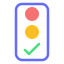

# Style Guide

Design decisions that apply across all IsiOne components (web, Android, iOS, hardware).

## Accessibility

IsiOne aims for [WCAG 2.x](https://www.w3.org/TR/WCAG22/) **AAA** for text contrast — 7:1 for normal text, 4.5:1 for large text. The light palette meets this across the board; the dark palette currently clears **AA** (4.5:1 / 3:1) and is held there to avoid regressing shipped surfaces. New surfaces should target AAA where possible and not fall below AA.

Status, feedback, and accent fills are not required to pass contrast thresholds on their own — what matters is the contrast of the label sitting on top of the fill, or of the surrounding role-coloured text.

## Colours

### Status Colours

Task status is communicated through colour across all platforms (web, mobile, hardware LEDs).

| Status | Colour | Hex | Usage |
|--------|--------|-----|-------|
| OK |  | `#4ade80` | Task completed within schedule |
| Pending |  | `#a78bfa` | Task due but not yet overdue |
| Overdue |  | `#f87171` | Task past its due time |

### Accent

| Name | Colour | Hex | Usage |
|------|--------|-----|-------|
| Primary |  | `#646cff` | Links, active states, primary buttons |
| Primary hover |  | `#535bf2` | Hover state for primary elements |

### Feedback

| Name | Colour | Hex | Usage |
|------|--------|-----|-------|
| Success |  | `#4ade80` | Confirmation, complete actions |
| Warning |  | `#fbbf24` | Warnings, caution states |
| Error |  | `#f87171` | Errors, destructive actions |

### Neutrals (Dark Theme)

| Name | Colour | Hex | Usage |
|------|--------|-----|-------|
| Background |  | `#1a1a1a` | Page/card backgrounds |
| Surface |  | `#2a2a2a` | Elevated elements (menus, dropdowns) |
| Border |  | `#333333` | Dividers, card borders |
| Text primary |  | `#ffffff` | Main text |
| Text secondary |  | `#aaaaaa` | Descriptions, secondary info |
| Text muted |  | `#888888` | Tertiary text, placeholders |

`#888888` on `#1a1a1a` is ≈4.9:1 — the binding row that holds the dark palette at AA rather than AAA.

### Neutrals (Light Theme)

Canonical light palette. Roles mirror the dark theme 1:1 so each platform maps the same role names to a different value set.

| Name | Colour | Hex | Usage | Contrast on `#ffffff` |
|------|--------|-----|-------|-----------------------|
| Background |  | `#ffffff` | Page/card backgrounds | — |
| Surface |  | `#f5f5f5` | Elevated elements (menus, dropdowns) | — |
| Border |  | `#d4d4d4` | Dividers, card borders | — |
| Text primary |  | `#171717` | Main text | 17.9:1 |
| Text secondary |  | `#404040` | Descriptions, secondary info | 10.4:1 |
| Text muted |  | `#525252` | Tertiary text, placeholders | 7.8:1 |

### Theme-agnostic Colours on Light

Status, feedback, and accent colours are intended to render unchanged in both palettes. They were chosen against the dark background; several have low contrast on `#ffffff`:

| Colour | On `#1a1a1a` | On `#ffffff` |
|--------|--------------|--------------|
| OK / Success `#4ade80` | 10.0:1 | 1.7:1 |
| Pending `#a78bfa` | 6.4:1 | 2.7:1 |
| Overdue / Error `#f87171` | 6.3:1 | 2.8:1 |
| Warning `#fbbf24` | 10.4:1 | 1.7:1 |
| Primary `#646cff` | 4.3:1 | 4.1:1 |
| Primary hover `#535bf2` | 3.4:1 | 5.1:1 |

These are usable as fills carrying a dark label on top (a status pill filled `#4ade80` with `#171717` text reads ≈9:1) but fail WCAG AA when used as foreground colour on `#ffffff`. Adjustments are made at the use-site, not by overriding the tokens per theme:

- **Status/feedback indicators on a light surface** — outline the shape in `#171717`, or use a darker fill for the indicator only, so it reads against white.
- **Primary as a button fill** — white text on `#646cff` is 4.1:1, sub-AA for body-size labels. Fill with `#535bf2` (5.1:1) or use `#171717` as the label colour.
- **Inline links on white** — use `#535bf2` (5.1:1) rather than `#646cff` (4.1:1).

### Theme Resolution

Surfaces decide which palette to render in three layers:

1. **Default** is dark. Without any theme signal, surfaces render the dark palette.
2. **System preference** selects light when the OS or runtime reports a light preference — unless an explicit choice overrides it.
3. **Explicit user choice** wins over both. A user who has selected dark continues to see dark on a light system, and vice versa.

"System" is the result of step 2 — the absence of an explicit choice — not a third palette. Surfaces with a theme picker should expose two modes (light, dark) plus a "follow system" option that clears the stored explicit choice.

How the three layers are wired is platform-specific and lives in each component's own documentation.

## Logo

{ width="64" }

A traffic light with a checkmark, representing the three task states (overdue, pending, OK). Uses the status colours (`#f87171`, `#fbbf24`, `#4ade80`) with a primary accent (`#646cff`) border.

The source SVG is at [`docs/assets/logo.svg`](assets/logo.svg). Use it for favicons, app icons, and anywhere the brand mark is needed.

## Task Identity

These elements identify tasks to users and must be consistent across all platforms.

### Icons

All task icons use [Lucide](https://lucide.dev/), an open-source icon library.

### Task Label Font

The font used for task names/headings across all platforms.

**[Nunito](https://fonts.google.com/specimen/Nunito)** - A sans-serif with rounded terminals, friendly and legible at small sizes.

- Use **Medium (500)** or **Semi-Bold (600)** weight
- Semi-Bold recommended for 3D printed hardware labels

## Platform-Specific Styles

Fonts for body text, UI elements, and other non-task content are defined per-platform in their respective documentation.
